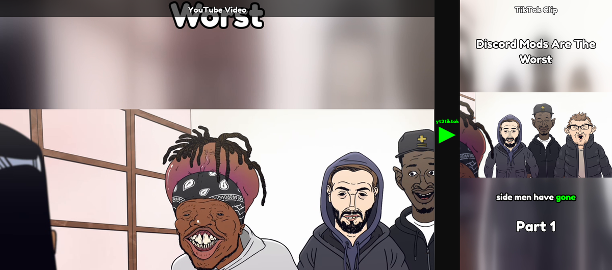
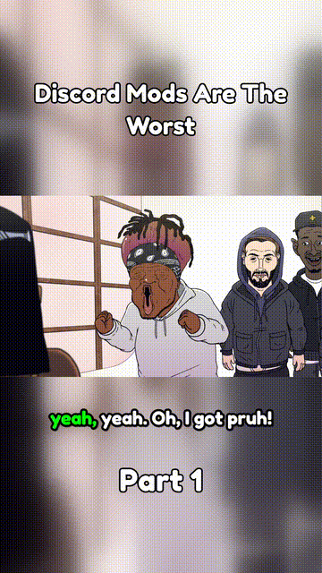

# yt2tiktok

A desktop application that downloads YouTube videos, splits them into 60-70 second vertical clips optimized for TikTok, burns in animated word-by-word captions, and uploads clips on a configurable schedule.

Built with CustomTkinter for a modern dark-themed interface.



### Captions in action



## Features

- **YouTube Download** -- Paste any YouTube URL to download via yt-dlp (1080p max, MP4)
- **Smart Clipping** -- Splits videos into 60-70s segments using Natural Pause (silence-based) or Cliffhanger (LLM hook point) cut modes
- **Blurred Background** -- 9:16 vertical clips with a blurred, zoomed copy of the video as the background
- **GPU Acceleration** -- NVENC hardware encoding with automatic CPU (libx264) fallback
- **Parallel Encoding** -- Clips encode concurrently (2-4x faster on multi-core machines)
- **Auto-Generated Captions** -- Word-by-word karaoke-style captions burned directly into each clip via ASS subtitles
- **6 Caption Style Presets** -- Opus Clean, Bold Pop, Neon Glow, Impact, Pastel, and Minimal
- **Width-Adaptive Phrases** -- Caption grouping based on actual text width, not word count; single-word orphans are always merged into neighbors
- **Hybrid Transcription** -- YouTube captions (instant, accurate) with automatic whisper fill-in for censored words; falls back to local faster-whisper (large-v3-turbo > medium > base) when captions are unavailable
- **Uncensored Captions** -- Detects YouTube's profanity censorship and fills censored words using local whisper so captions match what's actually said
- **Per-Clip Keyword Highlighting** -- LLM-driven keyword detection per clip highlights impactful words in green; falls back to heuristic when no LLM is configured
- **Centralized Config** -- All settings persist to `~/.yt2tiktok.json` with thread-safe reads and writes

## Roadmap

These features are implemented in code but **not yet tested or verified**:

- [ ] **CustomTkinter GUI** -- Desktop interface for the full pipeline (main.py)
- [ ] **Caption Preview Window** -- Interactive drag-to-reposition preview
- [ ] **TikTok Upload** -- Selenium-driven uploads with cookie auth, scheduling, quiet hours, retry logic
- [ ] **Black Bars Mode** -- Letterboxed 9:16 with solid black padding (alternative to blurred)
- [ ] **Long Video Guard** -- Warning dialog for videos over 2 hours
- [ ] **Multi-Provider LLM** -- OpenAI, Gemini, Claude, Ollama support (only Groq tested so far)
- [ ] **Caption Templates** -- `{title}`, `{part}`, `{total}` placeholders for TikTok post captions

## Caption Presets

All presets use Fredoka One with word-by-word karaoke-style highlighting. The active word snaps to the highlight color; keywords detected by the LLM get extra emphasis.

| Preset | Highlight Color | Animation | Font Size | Uppercase |
|--------|----------------|-----------|-----------|-----------|
| Opus Clean | Green | None | 72 | No |
| Bold Pop | Green | Fade | 68 | No |
| Neon Glow | Cyan | Bounce | 66 | No |
| Impact | Red | Slam | 72 | Yes |
| Pastel | Pink | Fade | 64 | No |
| Minimal | Warm yellow | Fade | 56 | No |

## Requirements

- Python 3.10+
- [FFmpeg](https://ffmpeg.org/download.html) installed and available in `PATH`

## Quick Start

```bash
git clone https://github.com/ethanstoner/yt2tiktok.git
cd yt2tiktok
python -m venv venv
source venv/bin/activate      # Windows: venv\Scripts\activate
pip install -r requirements.txt
python main.py
```

### Optional: NVIDIA Parakeet (faster, higher-accuracy transcription)

Requires a CUDA-capable GPU and roughly 5 GB of VRAM.

```bash
pip install -r requirements-parakeet.txt
```

When both NeMo and a CUDA device are detected at runtime, the app automatically uses Parakeet instead of faster-whisper. No configuration change is needed.

## How It Works

```
YouTube URL ──> yt-dlp download
                    │
        ┌───────────┴───────────┐
   YouTube captions          Local whisper
   (instant, accurate)       (fallback: large > medium > base)
        │                       │
        └───────┬───────────────┘
                │
     Censored words? ──> whisper fills gaps
                │
     ┌──────────┴──────────┐
 Natural Pause          Cliffhanger
 (silence gaps)        (LLM hook point)
     └──────────┬──────────┘
                │
         FFmpeg split (60-70s)
         [parallel encoding]
                │
     ┌──────────┴──────────┐
     │  Blurred Background  │  Black Bars
     │  (blur + overlay)    │  (pad 9:16)
     └──────────┬──────────┘
                │
     ASS captions burned in
     (word-by-word karaoke)
                │
         clips/<title>/*.mp4
```

### Clipping

1. Provide a YouTube URL or local MP4 file.
2. The app fetches YouTube captions instantly (or runs whisper locally for local files).
3. Censored words are automatically detected and filled in via whisper.
4. Choose a cut mode: **Natural Pause** finds silence-based boundaries; **Cliffhanger** uses an LLM to pick a hook point mid-sentence.
5. Clips are encoded in parallel with blurred 9:16 background and karaoke captions burned in.
6. Output saved to `./clips/<video-title>/`.

## LLM Setup (Optional)

LLM integration enables two features: **keyword highlighting** (picks the most impactful words to color in captions) and **Cliffhanger cut mode** (selects a hook point within each segment).

Open the **LLM Settings** panel in the app and configure:

| Field | Description |
|-------|-------------|
| Provider | `groq`, `openai`, `gemini`, `claude`, `ollama`, or `custom` |
| API Key | Your provider's API key (not required for Ollama) |
| Model | Leave blank to use each provider's default model |
| Base URL | Only needed for `custom` endpoints |

Default models per provider:

| Provider | Default Model |
|----------|--------------|
| Groq | llama-3.3-70b-versatile |
| OpenAI | gpt-4o-mini |
| Gemini | gemini-2.0-flash |
| Claude | claude-sonnet-4-latest |
| Ollama | llama3.1:8b |

If no LLM is configured, keyword detection falls back to a built-in heuristic (long words, numbers, and all-caps terms) and Cliffhanger mode is disabled.

## Configuration

All settings persist to `~/.yt2tiktok.json`:

| Setting | Default |
|---------|---------|
| Output directory | `./clips/` |
| Clip style | Blurred |
| Cut mode | Natural Pause |
| Caption preset | Opus Clean |
| Captions enabled | Yes |
| Caption vertical position | 73% from top |
| LLM provider | (none) |
| Clip duration | 60-70 seconds |

## Project Structure

```
yt2tiktok/
├── main.py                    # CustomTkinter GUI and thread management
├── src/
│   ├── clipper.py             # YouTube download, FFmpeg splitting, parallel encoding
│   ├── uploader.py            # TikTok cookie auth, Selenium upload, scheduling (untested)
│   ├── transcriber.py         # Hybrid YouTube captions + whisper fallback
│   ├── captioner.py           # ASS subtitle generation, 6 presets, keyword detection
│   ├── llm_provider.py        # Multi-provider LLM client (Groq, OpenAI, Gemini, Claude, Ollama)
│   ├── preview.py             # Caption preview window with drag-to-reposition
│   └── config.py              # Thread-safe JSON config persistence (~/.yt2tiktok.json)
├── fonts/                     # Bundled caption fonts (FredokaOne, Montserrat, BubblegumSans, RobotoCondensed)
├── assets/                    # README images and demo GIF
├── requirements.txt
├── requirements-parakeet.txt  # Optional: NeMo + NVIDIA Parakeet
└── clips/                     # Output directory (gitignored)
```

## Troubleshooting

**FFmpeg not found** -- Verify with `ffmpeg -version`. On Windows, install via `winget install --id Gyan.FFmpeg.Essentials -e`.

**Captions not appearing** -- Confirm FFmpeg was built with libass support (`ffmpeg -filters | grep ass`). Most standard builds include it.

**Transcription OOM** -- If `large-v3-turbo` crashes, the app automatically falls back to `medium` then `base`. Each model attempt runs in an isolated subprocess so OOM can't crash the app.

**LLM request timeout** -- The LLM client has a 30-second timeout. If your provider is slow or offline, keyword detection falls back to heuristic and Cliffhanger mode is disabled.

## License

[MIT](LICENSE)
